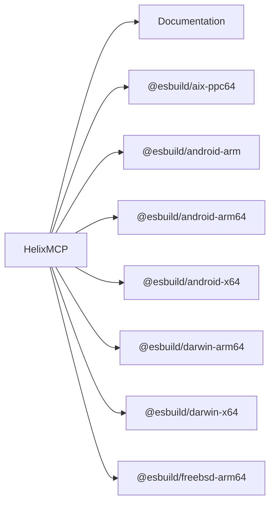
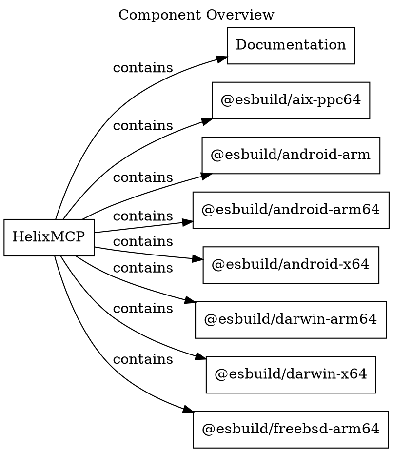
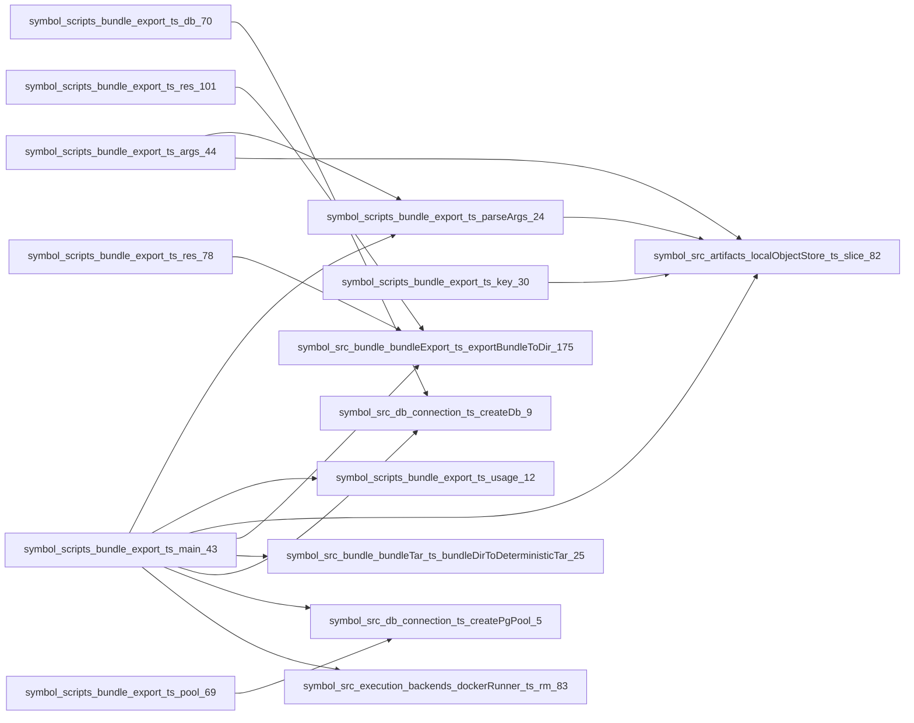
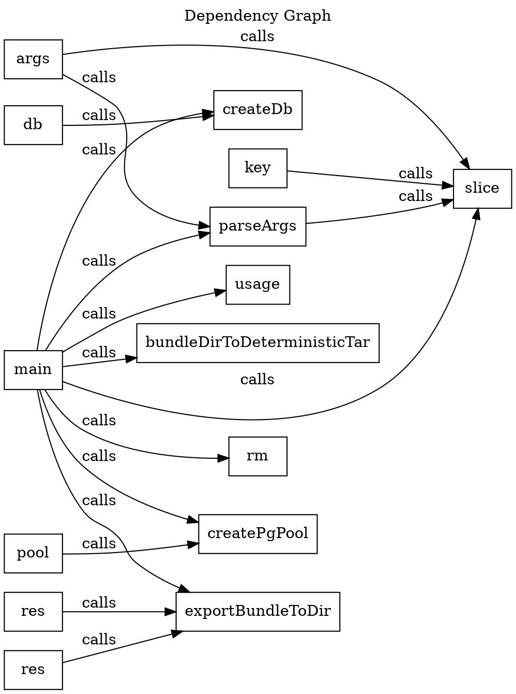
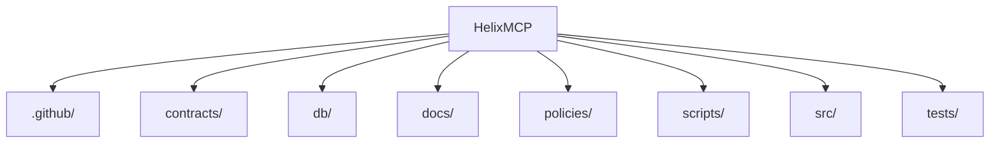
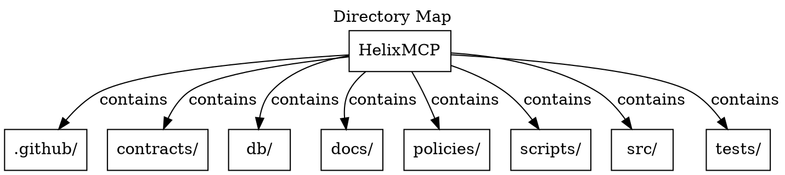
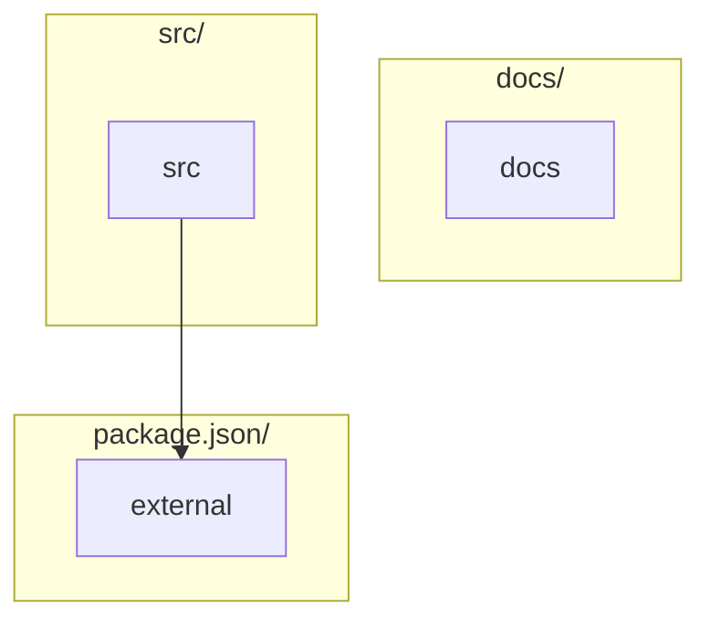
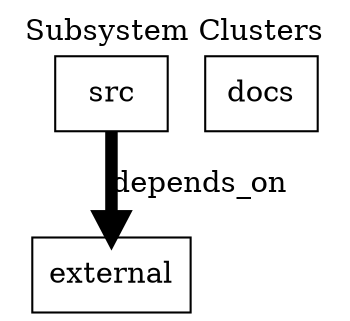

<details>
<summary>Build metadata</summary>

```json
{
  "freshnessKey": "cd3dd6dade0ca065796fd7841b9c8ffec6eac4cb",
  "plannerReason": "Generated to provide a compact architecture and dependency overview.",
  "changedPaths": [],
  "dependencyPaths": [],
  "dependencyEvidenceIds": [],
  "evidenceIds": [],
  "qualityWarnings": [
    "Diagrams has no citations."
  ]
}

```
</details>

# Diagrams

Generated 4 diagrams.

## Diagram Navigation

- [Component Overview](#component-overview) (component-overview; 9 nodes; 8 edges; omitted 223 nodes / 223 edges)
- [Dependency Graph](#dependency-graph) (dependency-graph; 15 nodes; 16 edges; omitted 0 nodes / 1511 edges)
- [Directory Map](#directory-map) (directory-map; 9 nodes; 8 edges)
- [Subsystem Clusters](#subsystem-clusters) (component-overview; 3 nodes; 1 edges; omitted 0 nodes / 839 edges)

## Related Pages

- [architecture](architecture.md)
- [dependencies](dependencies.md)
- [runtime](runtime.md)

## Component Overview

Shows the most prominent inferred components connected to the repository root.

Explained in:
- [Architecture Summary](architecture.md#architecture-summary)
- [Graph Hotspots](architecture.md#architecture-hotspots)
- [Design-Shaping Dependencies](dependencies.md#design-shaping-dependencies)

Interpretation note:
- Interpretation: use this view to see the main repository-owned components and their highest-level relationships before drilling into page-level details. Favor it when you need a fast inventory of the system surface.

Rendered surface:
- rendered nodes: 9, rendered edges: 8

Node mix:
- component: 8, repository: 1

Omitted surface:
- omitted nodes: 223
- omitted edges: 223





Structured graph:
- nodes: 9
- edges: 8

Layout:
- direction: LR
- strategy: root-spoke

Simplification:
- simplified: yes
- rendered nodes: 9
- rendered edges: 8
- omitted nodes: 223
- omitted edges: 223
- Omitted 223 lower-priority components to keep the overview readable.
- Switched to a left-to-right root-spoke layout to keep the largest components scannable.

Why these edges:
- Repository contains HelixMCP as a prominent component.
- Repository contains HelixMCP as a prominent component.
- Repository contains HelixMCP as a prominent component.
- Repository contains HelixMCP as a prominent component.
- Repository contains HelixMCP as a prominent component.
- Repository contains HelixMCP as a prominent component.

## Dependency Graph

Shows a sampled set of dependency and call relationships across indexed entities.

Explained in:
- [Graph Hotspots](architecture.md#architecture-hotspots)
- [Design-Shaping Dependencies](dependencies.md#design-shaping-dependencies)
- [Navigation Guidance](dependencies.md#dependency-guidance)

Interpretation note:
- Interpretation: use this graph to spot concentrated dependency hubs and outward package pressure across the repository. Favor it when you need to reason about coupling, likely blast radius, or external dependency concentration.

Rendered surface:
- rendered nodes: 15, rendered edges: 16

Node mix:
- symbol: 15

Omitted surface:
- omitted nodes: 0
- omitted edges: 1511





Structured graph:
- nodes: 15
- edges: 16

Layout:
- direction: LR
- strategy: edge-ranked

Simplification:
- simplified: yes
- rendered nodes: 15
- rendered edges: 16
- omitted nodes: 0
- omitted edges: 1511
- Omitted 1511 lower-priority dependency edges to avoid an unreadable graph.
- Kept a rank-ordered sample of stronger edges and switched to a left-to-right layout for denser graphs.

Why these edges:
- symbol:scripts/bundle_export.ts:args:44 calls symbol:scripts/bundle_export.ts:parseArgs:24 via scripts/bundle_export.ts.
- symbol:scripts/bundle_export.ts:args:44 calls symbol:src/artifacts/localObjectStore.ts:slice:82 via scripts/bundle_export.ts.
- symbol:scripts/bundle_export.ts:db:70 calls symbol:src/db/connection.ts:createDb:9 via scripts/bundle_export.ts.
- symbol:scripts/bundle_export.ts:key:30 calls symbol:src/artifacts/localObjectStore.ts:slice:82 via scripts/bundle_export.ts.
- symbol:scripts/bundle_export.ts:main:43 calls symbol:scripts/bundle_export.ts:parseArgs:24 via scripts/bundle_export.ts.
- symbol:scripts/bundle_export.ts:main:43 calls symbol:scripts/bundle_export.ts:usage:12 via scripts/bundle_export.ts.
- symbol:scripts/bundle_export.ts:main:43 calls symbol:src/artifacts/localObjectStore.ts:slice:82 via scripts/bundle_export.ts.
- symbol:scripts/bundle_export.ts:main:43 calls symbol:src/bundle/bundleExport.ts:exportBundleToDir:175 via scripts/bundle_export.ts.
- symbol:scripts/bundle_export.ts:main:43 calls symbol:src/bundle/bundleTar.ts:bundleDirToDeterministicTar:25 via scripts/bundle_export.ts.
- symbol:scripts/bundle_export.ts:main:43 calls symbol:src/db/connection.ts:createDb:9 via scripts/bundle_export.ts.

## Directory Map

Shows top-level directory layout to orient unfamiliar agents.

Interpretation note:
- Interpretation: use this map to orient yourself in the repository layout before reading code. Favor it when you need to connect top-level paths to the graph surfaces shown elsewhere.

Rendered surface:
- rendered nodes: 9, rendered edges: 8

Node mix:
- directory: 8, repository: 1





Structured graph:
- nodes: 9
- edges: 8

Layout:
- direction: TD
- strategy: linear-map

Simplification:
- simplified: no
- rendered nodes: 9
- rendered edges: 8
- omitted nodes: 0
- omitted edges: 0

Why these edges:
- .github/ is a top-level directory under the repository root.
- contracts/ is a top-level directory under the repository root.
- db/ is a top-level directory under the repository root.
- docs/ is a top-level directory under the repository root.
- policies/ is a top-level directory under the repository root.
- scripts/ is a top-level directory under the repository root.
- src/ is a top-level directory under the repository root.
- tests/ is a top-level directory under the repository root.

## Subsystem Clusters

Shows a simplified subsystem graph grouped by dominant repository paths and graph-connected merges.

Explained in:
- [Subsystem Clusters](architecture.md#architecture-subsystems)
- [Architecture Summary](architecture.md#architecture-summary)

Interpretation note:
- Interpretation: use this clustering view to understand which source areas act like larger architectural slices and how strongly they connect. Favor it when you need a quick map of architectural boundaries instead of individual files or packages.

Rendered surface:
- rendered nodes: 3, rendered edges: 1

Node mix:
- subsystem: 3

Omitted surface:
- omitted nodes: 0
- omitted edges: 839





Structured graph:
- nodes: 3
- edges: 1

Layout:
- direction: TD
- strategy: hierarchy-ranked

Simplification:
- simplified: yes
- rendered nodes: 3
- rendered edges: 1
- omitted nodes: 0
- omitted edges: 839
- Collapsed 839 additional subsystem edges from the rendered view.
- Grouped subsystem nodes by dominant path segment across 3 hierarchy buckets before rendering edges.

Why these edges:
- src depends_on external via src/core/ids.ts. 48 additional inferred edges reinforce this path. (49 inferred edges combined.)